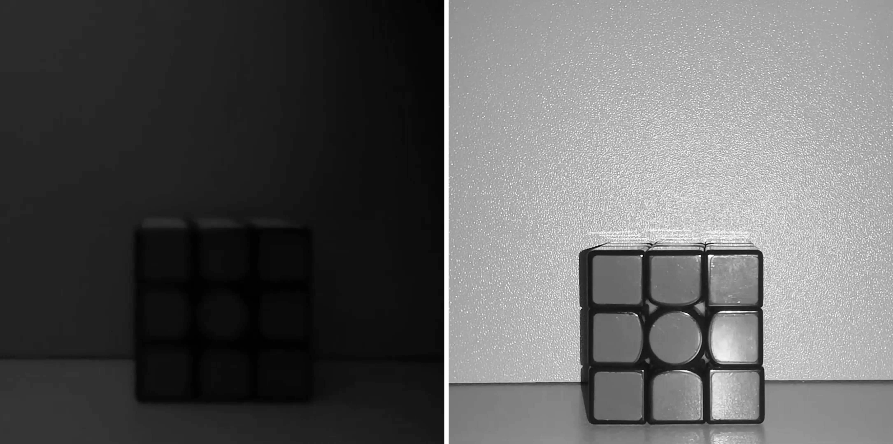

# Denoising Video
This document describes the analysis of **two videos**, one captured under **good lighting conditions** and another under **bad lighting conditions**. Both videos are **4 seconds** long, recorded at **60 fps**, resulting in a total of **240 frames** each. From each video, **The first 100 frames are processed**.

## Processing Steps
1. **Conversion to grayscale:** The frames are converted from RGB to grayscale format.

2. **Trim:** Each video is trimed to 200 frames.

3. **Noise reduction:** A two-dimensional adaptive noise removal filter (wiener2) is applied to each grayscale frame to reduce noise to the 100 first frames.

4. **Saving:** The denoised frames are saved as a separate video.

5. **SNR Calculation:** After processing the first 100 frames, the Signal-to-Noise Ratio (SNR) is calculated for each video in two scenarios:
      1. **Frame 101:** The SNR is calculated directly from the 101st frame of each video, based on its pixel values.
   
      2. **First 100 frames:** The SNR is calculated for the entire set of 100 processed frames for each video, considering the accumulated pixel values.
   
      3. This **analysis** allows us to compare the signal quality and noise levels in both videos under different lighting conditions.

## Results
### Light Comparasion of the Frame 101 (*No deonoising process*)

    

### Light Comparasion of the Frame 1 (*Deonoising process*)

    

